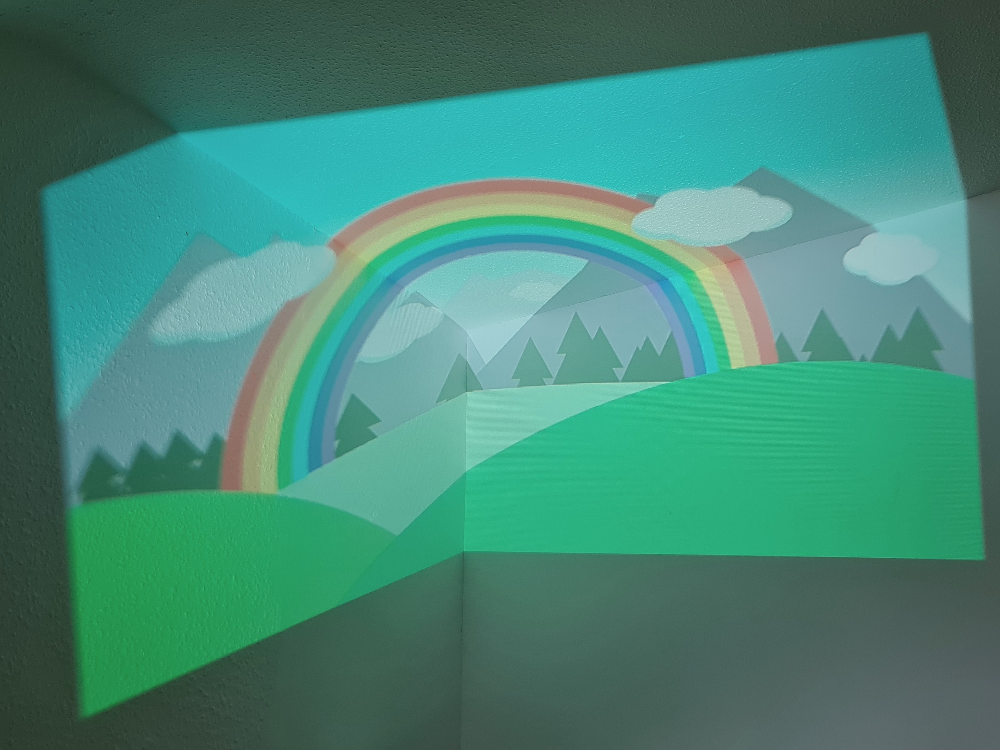

# Space Unfolded
Space Unfolded is a single point-of-view projector calibration system.
It is an OpenCV and CGAL-based solution for correcting projected images to the shape of the projection area.
This repository compiles into a DLL file with exported **calibrate(const char\*, const int\*, const int\*)** function, which will run the calibration on the images from the provided data folder.

Its arguments are:
* const char* **dataFolder** - Name of the folder with captured images
* const int* **projectionSize** - Size of the projection image a map will be created for
* const int* **contourPoints** - 4 sets of coordinates of the captured images area we want to display on, in form [x1, y1, x2, y2, x3, y3, x4, y4]

It also exports **calibrateRefined(const char\*, const int\*, const int\*, const int, const int)** function, which allows setting custom correction values,

Its last two arguments are:
* const int **meshRefinementCount** - Number of times the distortion correcting algorithm should be run
* const int **meshRefinementDistLimit** - Maximum distance a projection point can be affected from during each correction

Example capture and calibration process can be found inside [the examples folder.](examples/SimpleCalibrationInPython)

Below we can see the calibration effects we can expect when using this solution on a room corner.

**Before calibration**

**After calibration**

