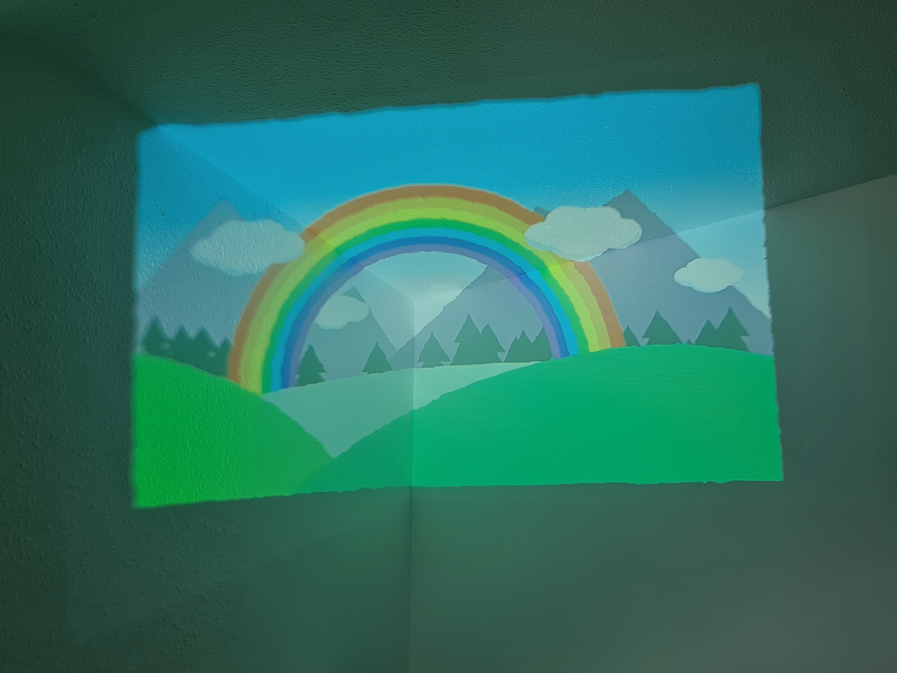

# Space Unfolded
Space Unfolded is a single point-of-view projector calibration system.
It is an OpenCV and CGAL-based solution for correcting projected images to the shape of the projection area.
This repository compiles into a DLL file with exported **calibrate(const char\*, const int\*, const int\*)** function, which will run the calibration on the images from the provided data folder.

Its arguments are:
* const char* **dataFolder** - Name of the folder with captured images
* const int* **projectionSize** - Size of the projection image a map will be created for
* const int* **contourPoints** - 4 sets of coordinates of the captured images area we want to display on, in form [x1, y1, x2, y2, x3, y3, x4, y4]

It also exports **calibrateRefined(const char\*, const int\*, const int\*, const int, const int)** function, which allows setting custom correction values,

Its last two arguments are:
* const int **meshRefinementCount** - Number of times the distortion correcting algorithm should be run
* const int **meshRefinementDistLimit** - Maximum distance a projection point can be affected from during each correction

Example capture and calibration process can be found inside [the examples folder.](examples/SimpleCalibrationInPython)

**A high-level step-by-step overview** of the algorithm is:
* Use a **Gray-Code pattern** to map camera pixels to projection pixels. 
* Calculate a **Delaunay triangulation** on all camera pixels found in the previous step.
* Mark triangles which when mapped to the projection are **clockwise or too small** as invalid.
* Keep count of the number of wrong triangles each point is part of with a **Fibonacci heap** and remove them starting from the ones with most errors until no invalid triangles are left. If two points have the same counts of wrong triangles, remove them in the order in which they were inserted into the heap. 
* **(optional)** Recalculate each projection point using a **homography** on its Delaunay neighbours and go back to the previous step. This can be done multiple times, increasing smoothness of the resulting map at the cost of precision and execution time.
* Create a **2D map** assigning camera pixels to projection pixels. 
* Draw each triangle into the 2D pixel map by interpolating the values inside it with its **affine transformation**.

Below we can see the calibration effects we can expect when using this solution on a room corner.

**Before calibration**

**After calibration**

